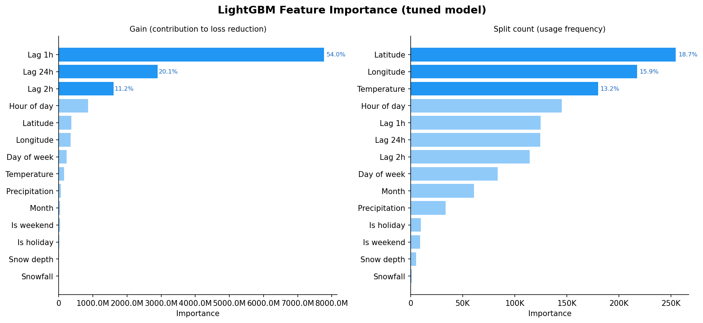
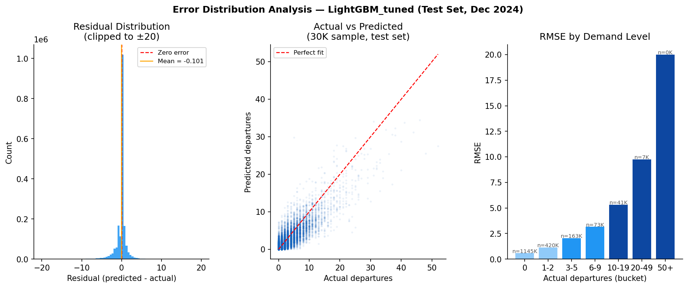
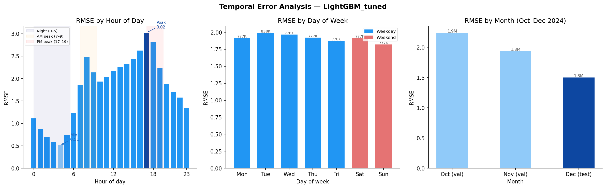
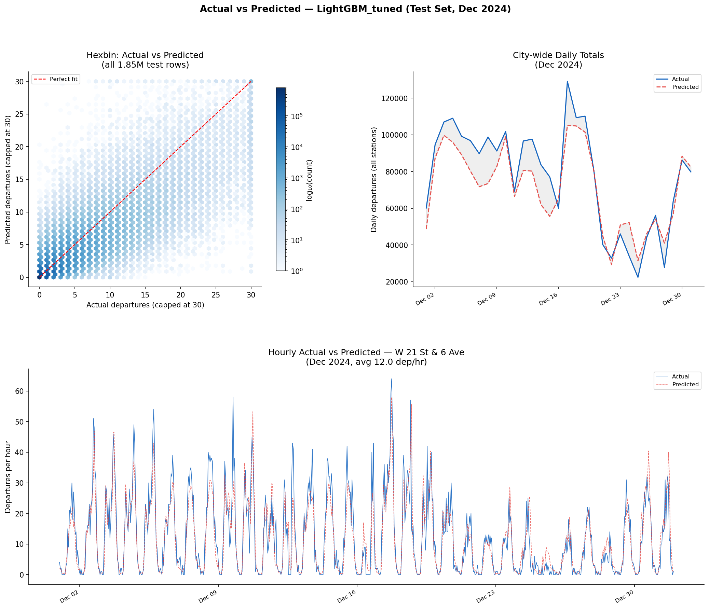
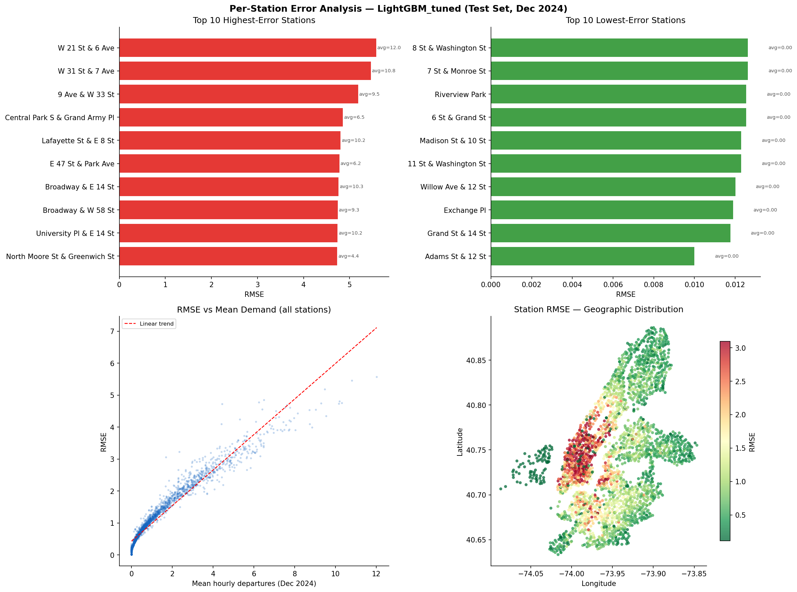

# Citi Bike Hourly Demand Prediction

Predicting hourly bike departure counts per station across the NYC Citi Bike network using regression models.

## Problem

Given a station, a time slot, and current weather, how many bike departures will occur in the next hour? This is a regression task over ~1,700 active stations and 17,520 hourly time slots (Jan 2023 – Dec 2024).

## Data Sources

| Source                                                                 | Description                                                                     | Period              |
| ---------------------------------------------------------------------- | ------------------------------------------------------------------------------- | ------------------- |
| [Citi Bike System Data](https://s3.amazonaws.com/tripdata/index.html)  | Raw trip records (ride_id, start/end station, timestamps)                       | Jan 2023 - Dec 2024 |
| [Open-Meteo Archive API](https://open-meteo.com/)                      | Hourly weather at Central Park (temp °F, precipitation, snowfall, snow depth)   | Jan 2023 - Dec 2024 |
| `holidays` (Python package)                                            | NY state federal holidays                                                       | 2023 - 2024         |

Raw data is **not committed** (≈25 GB). Download it with the script below.

## Repository Structure

```text
03project/
├── data/
│   ├── raw/
│   │   ├── citibike/          # Trip CSVs (downloaded, git-ignored)
│   │   └── weather/           # Weather + holiday CSVs (downloaded, git-ignored)
│   └── processed/
│       ├── hourly_demand.csv  # Aggregated trips + weather (git-ignored)
│       └── features.parquet   # Final feature matrix (git-ignored)
├── models/                    # Serialized model files (git-ignored)
├── results/
│   └── metrics.csv            # RMSE / MAE for all models × splits
├── results/
│   ├── metrics.csv                 # RMSE / MAE for all models × splits
│   ├── lgbm_best_params.json       # Best hyperparameters from Optuna search
│   └── feature_importance.png      # Feature importance plot
├── src/
│   ├── download_data.py                  # Step 1 – download all raw data
│   ├── build_dataset.py                  # Step 2 – aggregate & merge into hourly_demand.csv
│   ├── build_features.py                 # Step 3 – feature engineering → features.parquet
│   ├── train_models.py                   # Step 4 – train Ridge, RF, XGBoost, MLP
│   ├── train_lgbm.py                     # Step 5 – train LightGBM
│   ├── tune_lgbm.py                      # Step 6 – Optuna tuning → LightGBM_tuned
│   └── analysis_feature_importance.py    # Step 7 – feature importance analysis
└── README.md
```

## Quickstart

### 1. Install dependencies

```bash
pip install pandas requests holidays pyarrow xgboost scikit-learn joblib
```

### 2. Download raw data

```bash
python src/download_data.py
```

Downloads ~10 GB of Citi Bike trip zips from S3 and fetches weather from Open-Meteo (no API key required). The 2023 archive is a nested zip-of-zips and is handled automatically.

### 3. Build the aggregated dataset

```bash
python src/build_dataset.py
```

Produces `data/processed/hourly_demand.csv` (~18.8M station-hour rows, only hours with ≥1 departure).

### 4. Build the feature matrix

```bash
python src/build_features.py
```

Produces `data/processed/features.parquet` (~43.6M rows, full station × hour grid).

### 5. Train and evaluate models

```bash
python src/train_models.py
```

Trains all four models and writes evaluation metrics to `results/metrics.csv`.

## Data Schema

### hourly_demand.csv

| Column | Type | Description |
|--------|------|-------------|
| `station_id` | str | Citi Bike station identifier |
| `station_name` | str | Human-readable station name |
| `start_lat` / `start_lng` | float | Station coordinates |
| `datetime` | datetime | Hour bucket, NYC local time |
| `departures` | int | **Target variable** — trip count in that hour |
| `temperature` | float | °F at Central Park |
| `precipitation` | float | Inches |
| `snowfall` | float | Inches |
| `snow_depth` | float | Inches |
| `is_holiday` | int | 1 if NY state holiday, else 0 |

### features.parquet (model input)

All columns above, plus:

| Column | Type | Description |
|--------|------|-------------|
| `hour_of_day` | int8 | 0–23 |
| `day_of_week` | int8 | 0 = Monday, 6 = Sunday |
| `month` | int8 | 1–12 |
| `is_weekend` | int8 | 1 if Saturday or Sunday |
| `lag_1h` | float32 | Departures at same station 1 hour prior |
| `lag_2h` | float32 | Departures at same station 2 hours prior |
| `lag_24h` | float32 | Departures at same station 24 hours prior |
| `split` | str | `train` / `val` / `test` |

Hours with zero departures are included (filled as 0) so the model learns quiet periods. The first 24 hours of each station's history are dropped (lag values unavailable).

**Leakage note:** lag features are computed by sorting the full dataset chronologically and shifting within each station group. A row's lag values come exclusively from earlier timestamps.

## Train / Val / Test Split

| Split | Period |
|-------|--------|
| Train | Jan 2023 – Sep 2024 |
| Val   | Oct – Nov 2024 |
| Test  | Dec 2024 |

## Models and Results

Six models are trained and compared using RMSE and MAE.

**Training scale:** Ridge, XGBoost, LightGBM, and LightGBM_tuned use the full 38M-row train set. Random Forest and MLP use a 5M-row random sample due to sklearn's scaling limitations. XGBoost and LightGBM both use early stopping on the validation set.

### Evaluation results

| Model           | Val RMSE | Val MAE | Test RMSE | Test MAE | Train data  |
| --------------- | -------- | ------- | --------- | -------- | ----------- |
| LightGBM_tuned *| 2.098    | 1.099   | 1.501     | 0.759    | 38M (full)  |
| LightGBM        | 2.137    | 1.129   | 1.503     | 0.769    | 38M (full)  |
| XGBoost         | 2.232    | 1.172   | 1.536     | 0.788    | 38M (full)  |
| MLP             | 2.249    | 1.169   | 1.564     | 0.792    | 5M (sample) |
| RandomForest    | 2.288    | 1.183   | 1.566     | 0.808    | 5M (sample) |
| Ridge           | 2.626    | 1.345   | 1.720     | 0.841    | 38M (full)  |

\* best model

**LightGBM_tuned performs best** (test RMSE = 1.501, MAE = 0.759), improving over the default LightGBM by ~0.1% RMSE and ~1.3% MAE. The tuning used 30 Optuna TPE trials on a 5M-row subsample, then retrained on the full 38M set.

Best hyperparameters found:

| Parameter          | Value  |
| ------------------ | ------ |
| `num_leaves`       | 457    |
| `learning_rate`    | 0.0183 |
| `min_child_samples`| 48     |
| `feature_fraction` | 0.742  |
| `bagging_fraction` | 0.964  |
| `reg_alpha`        | 0.380  |
| `reg_lambda`       | 9.400  |
| `max_bin`          | 511    |

Full metrics saved in `results/metrics.csv`. Best params saved in `results/lgbm_best_params.json`.

## Analysis

### Feature Importance



**Gain (contribution to loss reduction):**

| Feature     | Gain % | Interpretation                                     |
| ----------- | ------ | -------------------------------------------------- |
| Lag 1h      | 54.0%  | Recent demand is the strongest predictor           |
| Lag 24h     | 20.1%  | Same hour yesterday captures daily rhythm          |
| Lag 2h      | 11.2%  | Short-term momentum still informative              |
| Hour of day | 5.9%   | Intra-day demand pattern                           |
| Lat / Lng   | 5.0%   | Station location encodes neighborhood demand level |
| Day of week | 1.6%   | Weekday vs weekend pattern                         |
| Temperature | 1.1%   | Weather has modest but real influence              |
| Others      | 1.1%   | Precipitation, month, holidays, snowfall           |

The three lag features together account for **85% of gain**, confirming that short-term autocorrelation dominates prediction. Weather and calendar features contribute modestly but are still included in the model.

**Split count (usage frequency):** Latitude, longitude, and temperature are used far more frequently in splits than their gain suggests — the model uses them for fine-grained partitioning even though each individual split contributes little to loss reduction.

### Error Distribution



Analysis on the test set (Dec 2024, 1.85M station-hour rows):

| Metric                | Value  |
| --------------------- | ------ |
| Mean residual         | -0.101 |
| Std of residuals      | 1.498  |
| % rows overestimated  | 68.5%  |
| % rows underestimated | 27.4%  |

**Key findings:**

- **Near-zero bias:** Mean residual = -0.101, meaning the model very slightly underestimates on average. The residual distribution is sharply peaked around zero with a slight left skew.
- **Overestimation dominates for zero-demand hours:** 68.5% of predictions are above actual — largely because the model predicts a small positive value for quiet hours that actually had 0 departures (62% of the test set).
- **RMSE scales sharply with demand level:** Errors are small for low-demand hours (RMSE = 0.57 for zero-departure hours) but grow rapidly — RMSE reaches 20 for the 79 extreme-demand hours (50+ departures). The model struggles most at predicting demand spikes.
- **Actual vs predicted scatter** follows the diagonal closely at low demand, with fan-out at higher values confirming the above pattern.

### Temporal Error Analysis



Analysis on val + test (Oct–Dec 2024):

**RMSE by hour of day:**

| Period          | Hours    | RMSE range  |
| --------------- | -------- | ----------- |
| Night           | 00-05    | 0.51 - 1.11 |
| Morning ramp    | 06-09    | 1.23 - 2.48 |
| Midday          | 10-16    | 1.93 - 2.62 |
| PM peak (worst) | 17:00    | 3.02        |
| Evening decline | 18-23    | 1.35 - 2.81 |

**RMSE by day of week:**

| Day | RMSE  |
| --- | ----- |
| Mon | 1.917 |
| Tue | 1.994 |
| Wed | 1.966 |
| Thu | 1.922 |
| Fri | 1.878 |
| Sat | 1.919 |
| Sun | 1.820 |

**RMSE by month:**

| Month            | RMSE  |
| ---------------- | ----- |
| Oct 2024 (val)   | 2.242 |
| Nov 2024 (val)   | 1.937 |
| Dec 2024 (test)  | 1.501 |

**Key findings:**

- **PM rush hour is hardest to predict:** RMSE peaks at 17:00 (3.02), over 6x the overnight minimum (0.51 at 04:00). The AM peak (07:00-09:00, RMSE 1.86-2.48) is also elevated. High-demand hours with volatile ridership cause the largest errors.
- **Day of week matters little:** RMSE varies only from 1.82 (Sunday) to 1.99 (Tuesday) — a 9% spread. Weekends are not harder to predict than weekdays despite different usage patterns.
- **Winter months are easier:** RMSE drops from 2.24 (October) to 1.50 (December). Lower overall demand in colder months means fewer extreme-demand spikes, reducing absolute errors.

### Actual vs Predicted



Three complementary views of model fit on the test set (Dec 2024):

**City-wide daily totals:**

| Metric | Value                  |
| ------ | ---------------------- |
| RMSE   | ~12,400 departures/day |
| MAE    | ~10,100 departures/day |

**Focus station (W 21 St & 6 Ave — highest demand):**

| Metric | Value          |
| ------ | -------------- |
| RMSE   | 5.58 dep/hr    |
| MAE    | 3.56 dep/hr    |

**Key findings:**

- **Hexbin scatter:** The density is tightly concentrated along the perfect-fit diagonal for low-demand hours (0–5 departures), confirming accurate predictions for the majority of rows. At higher demand the cloud widens, consistent with the fan-out seen in the error distribution.
- **City-wide time series:** Aggregated daily totals track the actual trend closely. The model captures the Christmas/holiday dip (Dec 24–26) and the lower overall December ridership.
- **Single-station time series:** The model follows the daily rhythm (overnight low, daytime peaks) well even at the hardest station. It systematically under-predicts the largest spikes — consistent with the bias toward underestimation at high demand.

### Per-Station Error Analysis



Analysis on 2,453 stations with ≥100 test hours (Dec 2024):

| Metric          | Value  |
| --------------- | ------ |
| Mean RMSE       | 1.139  |
| Median RMSE     | 0.821  |
| 90th pct RMSE   | 2.582  |
| Max RMSE        | 5.576  |
| Min RMSE        | 0.010  |

**Top 10 highest-error stations (all in Manhattan):**

| Station                            | RMSE  | Avg demand/hr |
| ---------------------------------- | ----- | ------------- |
| W 21 St & 6 Ave                    | 5.576 | 12.0          |
| W 31 St & 7 Ave                    | 5.459 | 10.8          |
| 9 Ave & W 33 St                    | 5.183 | 9.5           |
| Central Park S & Grand Army Plaza  | 4.853 | 6.5           |
| Lafayette St & E 8 St              | 4.803 | 10.2          |

**Key findings:**

- **High-error stations are high-demand Manhattan hubs:** All top-10 worst stations are in Midtown and Lower Manhattan (Penn Station area, Chelsea, Union Square, Times Square corridor). They average 6-12 departures/hr and are subject to volatile demand spikes (events, weather, commute disruptions) that the model cannot fully capture.
- **Low-error stations are near-inactive:** The 10 best-predicted stations all have avg demand ≈ 0 departures/hr — these are likely new or seasonal stations in outer boroughs. Predicting near-zero is trivially easy.
- **RMSE scales with demand:** The RMSE vs mean demand scatter confirms a strong positive relationship — busier stations are systematically harder to predict. The median RMSE (0.82) is much lower than the mean (1.14), showing the distribution is right-skewed by a small number of very hard stations.
- **Geographic pattern:** The geographic scatter shows errors concentrated in lower and midtown Manhattan, with quieter Brooklyn and Queens stations well-predicted.

## Status

- [x] Data download pipeline (`src/download_data.py`)
- [x] Hourly aggregation + weather/holiday merge (`src/build_dataset.py`)
- [x] Feature engineering — time features + lag features (`src/build_features.py`)
- [x] Model training & evaluation — Ridge, RF, XGBoost, MLP (`src/train_models.py`), LightGBM (`src/train_lgbm.py`)
- [x] Hyperparameter tuning — LightGBM via Optuna 30-trial TPE search (`src/tune_lgbm.py`)
- [x] Results analysis — feature importance, error distribution, temporal error (`src/analysis_*.py`)
